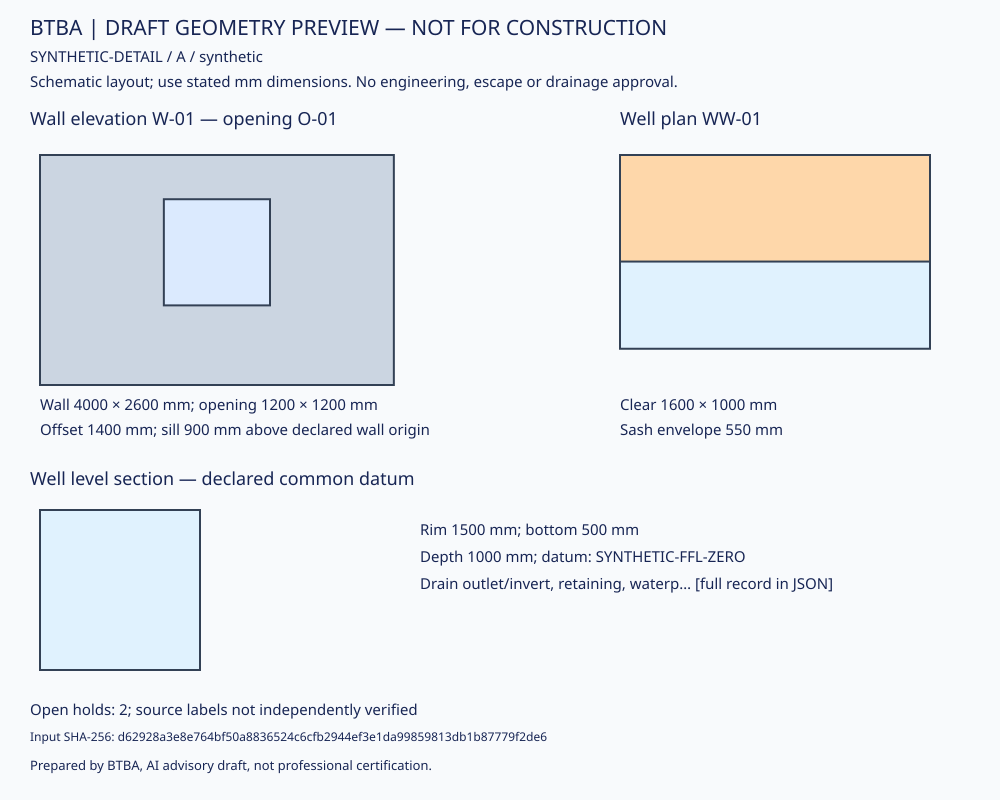

# Synthetic Wall / Opening / Window-Well Demonstration

*Prepared by BTBA, AI advisory draft, not professional certification.*

**Not a property, manufacturer product, recommended assembly or instruction to build.**
This original fixture demonstrates source-linked records and arithmetic. It is not
a construction drawing and has no claimed escape, structural or moisture adequacy.

Input: [synthetic-wall.json](synthetic-wall.json). Tool:
[tools/detail_package.py](../../tools/detail_package.py). Schema:
[schemas/detail-package.schema.json](../../schemas/detail-package.schema.json).

The [SVG preview](synthetic-preview.svg) is generated from the fixture and checked
against the renderer in tests. It is a dimension-labeled schematic, not a measured
construction drawing. The orange region is a simplified sash-projection band,
not an exact hinge/sweep or usable escape-space model. The CLI emits SVG with
`--format svg`; it does not write or overwrite files.

Tool version 1.1 clips long labels to available space with full text retained in
JSON and SVG tooltips. The report now explicitly marks well/opening alignment and
full sweep/access geometry not_assessed. No width comparison is an escape verdict.

## Declared Geometry and Layers

| Item | Fictional dimensions / relationship |
|---|---|
| W-01 | Rectangular 4,000 × 2,600 mm face, declared thickness 325 mm |
| Layers, outside → inside | Finish 20 + cavity 30 + sheathing 10 + core 200 + service zone 50 + lining 15 = 325 mm; no real product/assembly performance |
| O-01 within W-01 | Structural opening 1,200 × 1,200 mm; offset 1,400 mm, sill 900 mm above fictional common floor datum |
| O-01 product fields | Invented frame 1,150 × 1,150 mm; free opening 1,000 × 1,000 mm; simplified sash projection 550 mm |
| WW-01 outside O-01 | Clear width 1,600 mm; projection 1,000 mm from the fictional finished facade plane; bottom +500 mm and rim +1,500 mm relative to that common datum |
| Unresolved | Drain invert/outlet/capacity, terrain, retaining/support, waterproofing, actual product, tolerances, escape route and cover/ladder obstructions |

The layers are a record-format example, not a valid below-ground timber detail.
Important membrane, fixing, structural and exposure design is deliberately not
invented. The open design hold prevents these illustrative fields being mistaken
for a complete build-up.

## Expected Arithmetic and Holds

- Gross wall face: 10.40 m². Rectangular opening deduction: 1.44 m².
- Net single-face area: **8.96 m²**; not a whole-project or material order quantity.
- Well depth: **1,000 mm** from the two stated levels.
- Projection minus simplified sash envelope: **450 mm**. This is not usable escape
  clearance or compliance; other obstructions and access are not modeled.
- Drain invert stays **unknown**, not zero. Both design/drainage holds stay open.
- Report always retains `design_compliance: not_assessed` and
  `release: not_authorized`, even when geometric checks are consistent.

## Revision Demonstration

The automated test creates revision B in memory with sash projection 1,100 mm.
Expected: negative 100 mm projection remainder is a discrepancy; O-01, W-01 and
WW-01 require revalidation. W-01 is conservatively included because opening records
also drive its quantities. Original revision A is unchanged. A changed source
revision likewise invalidates dependent records, even if values happen to match.

This is a deterministic workflow test, not an LLM or professional-review result.
Actual tests and limits are recorded in the implementation status document.

Unknown layer thicknesses are included in the uncertainty list. Removing an open
hold in a later revision requires review and invalidates affected records; it is
not a closure event. Reports are independent copies, so editing one cannot change
its original input. Project-advisory records (unlike this synthetic fixture) also
require source-matched evidence_refs locators for every numeric quantity.